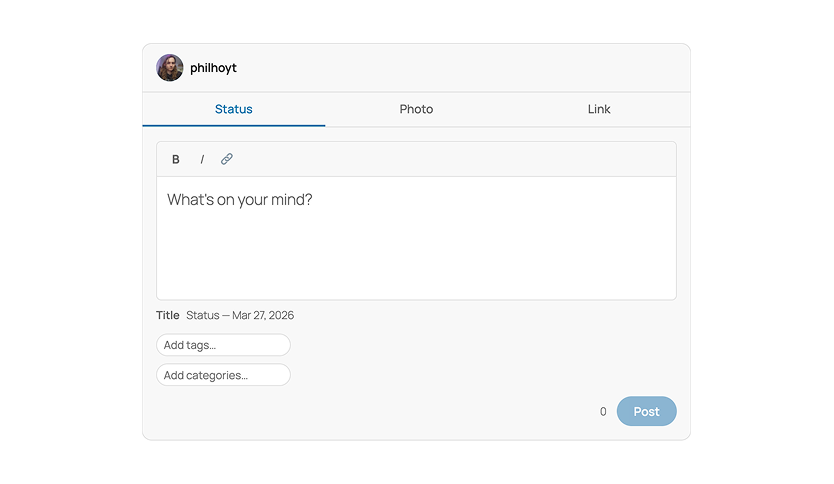

# QuickPostr



A front-end post composer for WordPress, delivered as a WordPress block. Logged-in users post status updates, photos, and links without visiting `/wp-admin`.

## Requirements

- WordPress 6.7+
- PHP 8.1+
- A theme that declares `add_theme_support( 'post-formats', [...] )`
- PHP Imagick extension — only required for EXIF stripping

## Blocks

| Block | Description |
|---|---|
| **QuickPostr Composer** | The composer itself. Place once per page. Auth-gated server-side. |
| **Edit Post** | Loads a post into the Composer for editing. Place inside a Query Loop template. |
| **Delete Post** | Trashes the current post. Place inside a Query Loop template. |
| **Share Post** | Calls `navigator.share()`. Requires HTTPS; button is hidden on HTTP. |

## Installation

Upload the plugin directory to `wp-content/plugins/` and activate. The `build/` directory is committed and ready to use — no build step required for deployment.

For development:

```bash
npm install
npm run build   # production build
npm start       # watch mode
```

PHP linting requires Composer dependencies:

```bash
composer install
composer lint       # PHPCS + WPCS
composer lint:fix   # phpcbf auto-fix
```

## Settings

**Settings → QuickPostr**

| Setting | Default | Notes |
|---|---|---|
| Allowed Roles | administrator, editor, author | Controls who sees the Composer block. |
| Default Post Status | publish | Set to `draft` to queue all posts for review. |
| Default Category | none | Applied to every new post. |
| Show Slug Preview | on | Displays the auto-generated title below the editor. |
| Hide Admin Bar | on | Hides the admin bar for non-administrator roles. |
| Hide Admin Bar (Administrators) | off | Separate toggle for the administrator role. |
| Front-End Post Management | on | Enables the Edit Post and Delete Post blocks. |
| Strip Photo Metadata | on | Strips EXIF on JPEG upload via `Imagick::stripImage()`. Silently skipped if Imagick is unavailable. |

Settings are stored in a single `wp_options` row under `quickpostr_settings`.

## Composer Modes

**Status** — Rich text editor. Supports bold, italic, and inline links. Auto-saves a draft every 800 ms. Title is generated server-side from the first 55 characters of content; the JS preview is for display only.

**Photo** — Drag-and-drop upload or WordPress media library picker. Caption is optional but used for title generation if present.

**Link** — Pastes a URL and fetches Open Graph metadata via the [Better Bookmarks](#better-bookmarks) REST endpoint. If Better Bookmarks is not installed, posts a plain `<a>` in the post content with format `link`.

## Post Titles

PHP generates the canonical title in `rest_after_insert_post`. The composer sends an empty title; the server overwrites it. Format:

- Content under 55 characters → content becomes the title.
- Content over 55 characters → truncated at the last word break before 55 characters, suffixed with `…`.
- No content (photo or link with no caption) → `Photo — Mar 26, 2026` / `Link — Mar 26, 2026`.

Titles are suppressed on the front end for QuickPostr posts via the `the_title` filter. They remain visible in `/wp-admin` and REST responses so ActivityPub and feed readers receive them.

## Authentication

All REST requests use cookie authentication with an `X-WP-Nonce` header (`wp_rest` action). No Application Passwords. The nonce is injected via `wp_add_inline_script` in `render.php` — the composer only works for users who load the page while logged in.

## Taxonomy

A private `quickpostr_source` taxonomy is registered on `post`. Each QuickPostr post receives the terms `app` and one of `status`, `photo`, or `link`. The taxonomy is not publicly queryable and does not appear in the admin UI. You can use `tax_query` to filter or exclude QuickPostr posts in custom queries.

```php
$query = new WP_Query( [
    'tax_query' => [ [
        'taxonomy' => 'quickpostr_source',
        'field'    => 'slug',
        'terms'    => 'app',
    ] ],
] );
```

## Better Bookmarks

QuickPostr detects whether the [Better Bookmarks](https://github.com/philhoyt/BetterBookmarks) plugin is active via `class_exists( 'Better_Bookmarks' )` and passes a `betterBookmarks` flag to the front-end config.

When active: the Link composer fetches OG metadata from `GET /better-bookmarks/v1/preview?url=` and serializes a `better-bookmarks/link-card` block as the post content:

```
<!-- wp:better-bookmarks/link-card {"url":"...","title":"...","description":"...","image":"...","domain":"..."} /-->
```

When not active: the same Link tab posts `<p><a href="url">title</a></p>` with post format `link`. The tab is always visible regardless of whether Better Bookmarks is installed.

## Known Limitations

- Link posts cannot be edited via the front-end Composer. Clicking Edit on a `link` format post loads the status composer instead.
- EXIF stripping only applies to JPEG uploads. PNGs and WebP are not processed.
- `navigator.share()` is not available on desktop browsers in most cases. The Share Post block hides itself when the API is absent.
- The Composer block renders nothing for logged-out visitors — there is no fallback UI or login prompt.
- Draft auto-save runs in `TextComposer` only. Photo and Link composers do not auto-save.
